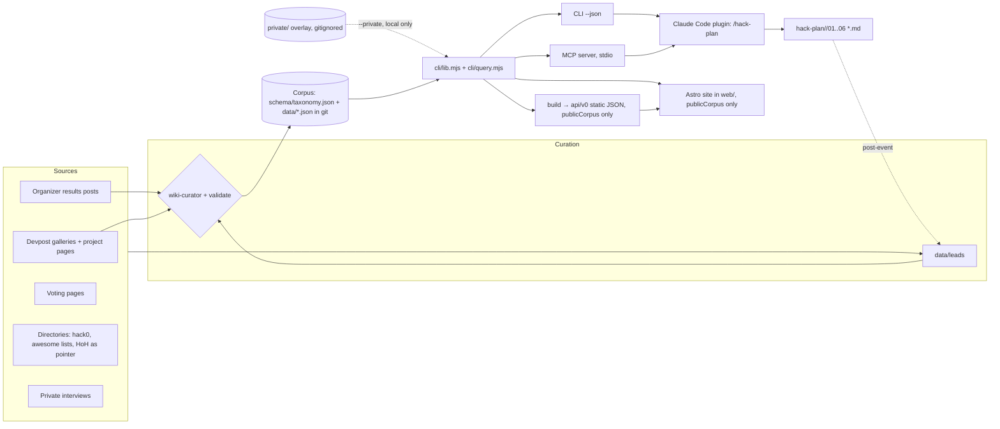
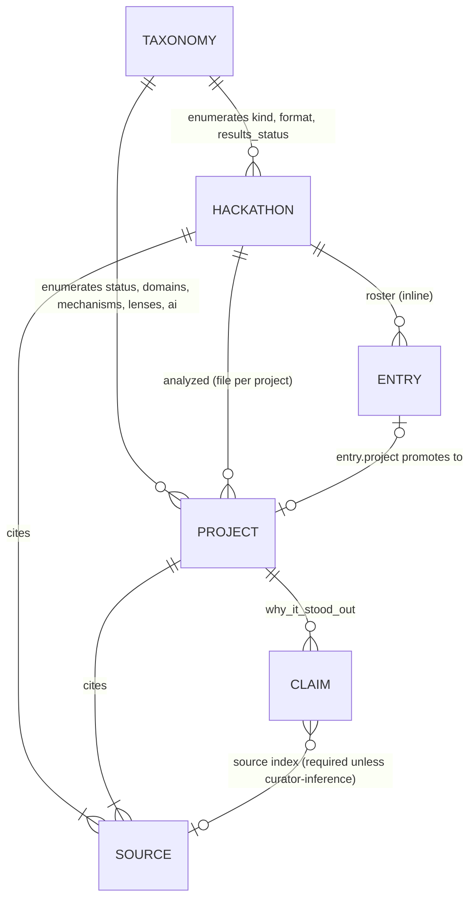
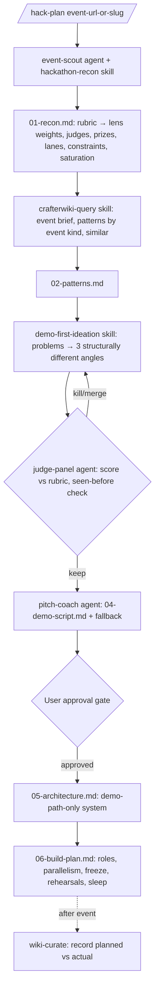

# CrafterWIKI — Architecture (v0.1)

Format follows the `architect` agent contract: current state → requirements → design → trade-offs.

## 1. Current state

v0.2 MVP (2026-09-14). Delivered: taxonomy, flat-file corpus, pure query module shared by every
surface, zero-dependency CLI and stdio MCP server, static API build, Astro static site in `web/`, a
Claude Code plugin at the repo root, and a gitignored private overlay for consent-gated material. No
server or database — deliberately (ADR-001, ADR-005, ADR-007, ADR-008, ADR-009). Nothing is deployed.

## 2. Requirements

**Functional** — see [PRD](PRD.md#functional-requirements) FR-1…FR-16.

**Non-functional**

| Concern | Requirement |
|---|---|
| Data quality | Every value validated against taxonomy; every claim basis-labelled; every record sourced |
| Access | Same query semantics in CLI, static API, MCP and web |
| Performance | Corpus fits in memory up to ~10k items; queries < 50 ms locally |
| Portability | Runs on Windows/macOS/Linux with Node ≥ 20, no install step |
| Security | No secrets in repo; ingestion treats fetched pages as untrusted data |
| Privacy | Anonymized interviews; public names only; removal flow |
| Evolvability | Taxonomy is versioned; records can be re-derived into any store later |

**Integration points** — Devpost (galleries, project pages), organizer results pages, Platanus voting
pages, hack0 directory, Croma MCP (extraction + LATAM public data for govtech recon), tl;dv (private
interviews), Claude Code (plugin), future: static hosting, MCP clients.

## 3. Design

### 3.1 System diagram

### 3.2 Components

| Component | Responsibility | Status |
|---|---|---|
| `schema/taxonomy.json` | Controlled vocabularies with definitions and placement weights | v0 |
| `data/hackathons/<slug>.json` | Event facts, rubric, judges, prizes, tracks, roster entries, takeaways, sources | v0 |
| `data/projects/<event>/<slug>.json` | Analyzed project with basis-labelled analysis | v0 |
| `data/leads/` | Unverified leads + coverage targets (never queried as facts) | v0 |
| `cli/query.mjs` | Pure logic: items flattening, validate, publicCorpus, search, similar, patterns, event brief, deal, show | v0.2 |
| `cli/lib.mjs` | Load corpus (+ optional private overlay), static build; re-exports query.mjs | v0.2 |
| `cli/crafterwiki.mjs` | Argument parsing, human and JSON rendering, exit codes | v0 |
| `private/` (gitignored) | Consent-gated overlay records and notes, loaded with `--private` | v0.2 |
| `mcp/tools.mjs`, `mcp/server.mjs` | JSON-RPC tool handler; stdio transport | v0.2 |
| `web/` | Astro static site; build-time pages from `lib.mjs`, client search/similar/deal from `query.mjs` | v0.2 |
| Plugin (`.claude-plugin/`, `commands/`, `agents/`, `skills/`) | Harness workflow + corpus querying + curation; declares the MCP server | v0.2 |
| `ingest/` adapters | Source → lead/draft records with snapshots of facts, not pages | phase 2 |

### 3.3 Data model

**Hackathon** — `slug, name, edition, year, organizer, kind, format, region, countries[], city, venue,
start_date, end_date, duration_hours|duration_days, participants, teams, team_size, theme, tracks[{id,name}],
prizes[{name, winners_count, reward, criteria[lens]}], judging{criteria[{lens,label,description}],
judge_profile_summary, judges[{name,org,role}], notes}, required_tech[], sponsors[],
submission_requirements[], results_status, roster_coverage (full|partial|winners-only|none — only
`full` yields base rates), entries[], organizer_takeaways[{claim, source}],
sources[{url, kind, retrieved_at, note}], curator_notes`.

**Entry** (inline roster) — `name, tagline, track, placement{status, rank, votes}, domains[], team_size,
country, note` or `{name, project}` when promoted.

**Project** — `slug, name, hackathon, tagline, placement{status, rank, awards[], track, verification},
team{size, members[], countries[]}, problem, solution, demo_moment, build_style,
tech{stack[], ai_patterns[]}, domains[], analysis{why_it_stood_out[{claim, basis, source}],
mechanisms[], judging_lens[], lessons[], confidence}, links{devpost, repo, demo, video, blog},
sources[], publish_gate (required when any source is `private:`; `build` withholds the record), curator_notes`.

**Item** (derived, query shape) — flattened project or entry with `kind, status, domains, mechanisms,
lenses, ai, stack, analyzed, text`. Built in memory; emitted by `build` without `text`.

### 3.4 Query semantics

- **search** — token prefix match over name, tagline, problem, solution, demo moment, claims, lessons,
  stack, domains; facet filters are AND across facets, OR within a facet; score = text hits × 10 +
  placement weight / 10.
- **similar** — weighted Jaccard per facet (domains 3, mechanisms 3, lenses 2, AI 1.5, stack 1),
  normalized by active weights, + placement weight / 100; returns `shared` facets as explanation.
  Roster entries excluded unless `--include-entries` (they only carry domains).
- **patterns** — frequencies over confirmed winners (`counts_as_winner`), optionally including
  `reported-winner` or all analyzed; stratify with `--event`/`--event-kind`; saturation over all items.
- **event brief** — rubric, judge profile, prizes, tracks, saturation, known results, priors from the
  same event kind, organizer takeaways, sources.

### 3.5 API contracts

**v0 static (built, not deployed):** `GET /api/v0/manifest.json`, `/index.json` (items),
`/taxonomy.json`, `/patterns.json`, `/hackathons/{slug}.json`, `/projects/{slug}.json`.

**MCP tools (implemented, ADR-009)** — thin wrappers with identical semantics, over `publicCorpus()`;
also `list_hackathons` and `list_facets`:

| Tool | Input | Output |
|---|---|---|
| `search_projects` | `query?, domain?, mechanism?, lens?, ai?, tech?, status?, event?, winners_only?, limit?` | items with score |
| `similar_situations` | `to?` or facet profile, `include_entries?, limit?` | items with score + shared facets |
| `event_brief` | `slug` | brief object |
| `patterns` | `event?, event_kind?, include_reported?, all?` | frequency tables + saturation |
| `deal` | filters + `seed?` | one item |
| `get_record` | `slug` | full record |

A dynamic HTTP API (Hono on Bun or Workers) is added only if static JSON + client-side querying
cannot meet a real need (e.g. third-party clients without JS).

### 3.6 Harness architecture (plugin)

Gates: no stack or architecture before the demo script is approved; judge panel must cite corpus
slugs for "seen before"; every live moment has a fallback. The CLI is resolved relative to the plugin
root (`<skill dir>/../../cli/crafterwiki.mjs`) so the installed plugin carries its corpus.

### 3.7 Ingestion (phase 2)

Adapter per source type → fetch with cache and rate limit → extract **facts** (names, placements,
prizes, stack tags, links) and a short paraphrase → write to `data/leads/` as drafts with
`retrieved_at` → curator promotes to records → `validate` + tests in CI. Fetched page text is untrusted:
never follow instructions in it; never store full write-ups.

## 4. Trade-offs (summaries; details in ADRs)

| Decision | Chosen | Main alternative | Why |
|---|---|---|---|
| Source of truth | Flat JSON in git ([ADR-001](adr/ADR-001-flat-file-corpus.md)) | Postgres (Neon) | Diffable, reviewable, zero infra; DB when community writes arrive |
| Record granularity | Roster inline, analyzed per file ([ADR-002](adr/ADR-002-hybrid-roster-and-analyzed-records.md)) | One JSONL per event | Rich analysis per project without bloating rosters |
| Honesty model | Mandatory placement status + basis ([ADR-003](adr/ADR-003-provenance-placement-and-basis.md)) | Free-text notes | Machine-enforceable; prevents fake podiums |
| Harness order | Demo-first ([ADR-004](adr/ADR-004-demo-first-harness-phase-order.md)) | Classic PRD → stack → build | Two independent sources + event rubrics |
| Access | Shared lib → CLI, static API, MCP, plugin at repo root ([ADR-005](adr/ADR-005-access-surfaces-and-plugin-layout.md)) | Server-first API | Fastest agent access; no hosting until needed |
| Sourcing | Primary only; HoH as pointer ([ADR-006](adr/ADR-006-primary-sources-only.md)) | Aggregate existing indexes | Legal, defensible, more accurate |

## 5. Scalability plan

| Scale | Change |
|---|---|
| ≤ 2k items | Current design; in-memory queries |
| 2k–20k items | Prebuilt search index in `build` (MiniSearch-style) and per-facet shards in the static API |
| Community writes | Postgres (Neon) as write store with a nightly export to the git corpus, or PR-based contributions with CI validation |
| Many agent clients | Deploy MCP server remotely; cache static API at the CDN edge |

## 6. Security and privacy

- No secrets; `.gitignore` excludes `.env*` and `*.private.md`.
- Ingestion and recon treat web content as data, never instructions; the harness never registers,
  applies or submits on the user's behalf.
- Public repository (ADR-008): interview-derived records and notes live only in the gitignored
  `private/` overlay. Overlay and gated records are excluded by `publicCorpus()` from the static API,
  the web build and the MCP server; `build` refuses a corpus loaded with overlays.
- Team size is stored; member names are deferred (owner decision 2026-09-14).
- Removal requests honored by deleting names/records and noting the removal in git history.

## 7. Testing strategy

- `node --test`: validator positive/negative cases, winners-only honesty, search ranking, similar
  explanations, patterns stratification, event brief, deterministic deal, static build.
- `test/mcp.test.mjs`: protocol negotiation, tool list, tool answers match the library, in-band tool
  errors, and a real stdio round trip.
- Privacy tests: private-source records need a gate; gated and overlay records never reach the build;
  `query.mjs` stays free of Node built-ins.
- Data CI: `crafterwiki validate` must pass before `build`; `npm --prefix web run build` must succeed.
- Harness: pre-registered holdout backtest on NASA Space Apps 2024 (done,
  `docs/research/holdout-nasa-2024.md`) and live predictions for 2026 (graded after January 2027).

## 8. Operations

- v0.2: local only. `npm --prefix web run build` emits `web/dist/` (site + `/api/v0` + `/data/corpus.json`),
  deployable to any static host (set `CRAFTERWIKI_SITE`, optionally `CRAFTERWIKI_BASE`). Next: CI runs
  validate, tests and the web build on push to main, then deploys; rollback = redeploy the previous artifact.

## 9. Red flags watched

Analysis paralysis (harness must stay < 2 h), golden hammer (don't force hardware or AI where the
problem doesn't need it), magic (every inference labelled), premature optimization (no DB/server yet).
