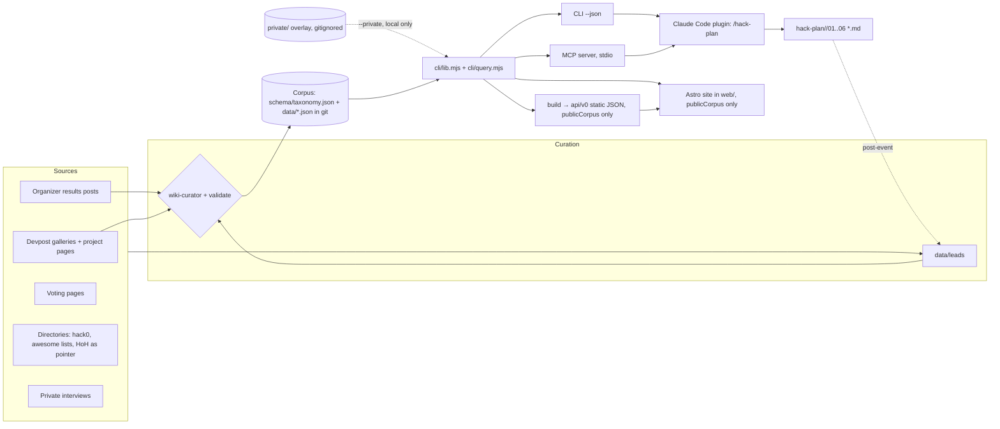
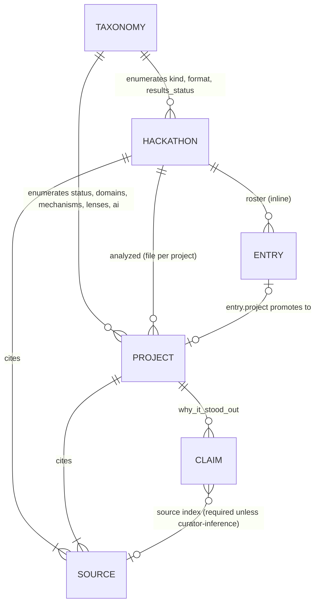
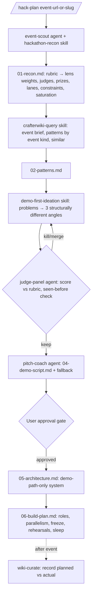

# CrafterWIKI — Architecture (v0.1)

Format follows the `architect` agent contract: current state → requirements → design → trade-offs.

## 1. Current state

v0.2 MVP (2026-09-14). Delivered: taxonomy, flat-file corpus, pure query module shared by every
surface, zero-dependency CLI and stdio MCP server, static API build, Astro static site in `web/`, a
Claude Code plugin at the repo root, and a gitignored private overlay for consent-gated material. No
server or database — deliberately (ADR-001, ADR-005, ADR-007, ADR-008, ADR-009). Nothing is deployed.

## 2. Requirements

### Public builder website direction

Audience: hackathon teams and independent builders choosing a useful, feasible idea.
Primary journey: inspect references → compare approaches → write and download a builder brief.
Brand (2026-09-18): Space Grotesk (self-hosted) for the wordmark and page titles, Geologica for
body text; a single-colour orange wordmark; warm black base `#100e0b` with the "Crimson Veil" aura
behind the landing hero only (layers switch to `multiply` in the light theme). Keep the orange
action color and the provenance labels.
Make the homepage a working index: compact search, evidence counts, varied real references and
a clear planning entry point. No invented win-rate claims, testimonials or decorative imagery.
The planner uses a focused two-column worksheet on desktop and a single column on mobile;
the output is a downloadable Markdown brief. Inputs stay in page memory, with no automatic
storage or transmission. No accounts, analytics, external AI calls or new dependencies.
Verify search, project links, form validation, mode switching, download, keyboard focus,
mobile overflow and public HTTPS access. Deploy only built public files to Vercel.

**Functional** — see [PRD](PRD.md#functional-requirements) FR-1…FR-16.

**Non-functional**

| Concern | Requirement |
|---|---|
| Data quality | Every value validated against taxonomy; every claim basis-labelled; every record sourced |
| Access | Same query semantics in CLI, static API, MCP and web |
| Performance | Corpus fits in memory up to ~10k items; queries < 50 ms locally |
| Portability | Runs on Windows/macOS/Linux with Node ≥ 20, no install step |
| Security | No secrets in repo; ingestion treats fetched pages as untrusted data |
| Privacy | Anonymized interviews; public names only; removal flow |
| Evolvability | Taxonomy is versioned; records can be re-derived into any store later |

**Integration points** — Devpost (galleries, project pages), organizer results pages, Platanus voting
pages, hack0 directory, Croma MCP (extraction + LATAM public data for govtech recon), tl;dv (private
interviews), Claude Code (plugin), future: static hosting, MCP clients.

## 3. Design

### 3.1 System diagram

### 3.2 Components

| Component | Responsibility | Status |
|---|---|---|
| `schema/taxonomy.json` | Controlled vocabularies with definitions and placement weights | v0 |
| `data/hackathons/<slug>.json` | Event facts, rubric, judges, prizes, tracks, roster entries, takeaways, sources | v0 |
| `data/projects/<event>/<slug>.json` | Analyzed project with basis-labelled analysis | v0 |
| `data/leads/` | Unverified leads + coverage targets (never queried as facts) | v0 |
| `cli/query.mjs` | Pure logic: items flattening, validate, publicCorpus, search, similar, patterns, event brief, deal, show | v0.2 |
| `cli/lib.mjs` | Load corpus (+ optional private overlay), static build; re-exports query.mjs | v0.2 |
| `cli/crafterwiki.mjs` | Argument parsing, human and JSON rendering, exit codes | v0 |
| `private/` (gitignored) | Consent-gated overlay records and notes, loaded with `--private` | v0.2 |
| `mcp/tools.mjs`, `mcp/server.mjs` | JSON-RPC tool handler; stdio transport | v0.2 |
| `web/` | Astro static site; build-time pages from `lib.mjs`, client search/similar/deal from `query.mjs` | v0.2 |
| Plugin (`.claude-plugin/`, `commands/`, `agents/`, `skills/`) | Harness workflow + corpus querying + curation; declares the MCP server | v0.2 |
| `ingest/` adapters | Source → lead/draft records with snapshots of facts, not pages | phase 2 |

### 3.3 Data model

**Hackathon** — `slug, name, edition, year, organizer, kind, format, region, countries[], city, venue,
start_date, end_date, duration_hours|duration_days, participants, teams, team_size, theme, tracks[{id,name}],
prizes[{name, winners_count, reward, criteria[lens]}], judging{criteria[{lens,label,description}],
judge_profile_summary, judges[{name,org,role}], notes}, required_tech[], sponsors[],
submission_requirements[], results_status, roster_coverage (full|partial|winners-only|none — only
`full` yields base rates), entries[], organizer_takeaways[{claim, source}],
sources[{url, kind, retrieved_at, note}], curator_notes`.

**Entry** (inline roster) — `name, tagline, track, placement{status, rank, votes}, domains[], team_size,
country, note` or `{name, project}` when promoted.

**Project** — `slug, name, hackathon, tagline, placement{status, rank, awards[], track, verification},
team{size, members[], countries[]}, problem, solution, demo_moment, build_style,
tech{stack[], ai_patterns[]}, domains[], analysis{why_it_stood_out[{claim, basis, source}],
mechanisms[], judging_lens[], lessons[], confidence}, links{devpost, repo, demo, video, blog},
sources[], publish_gate (required when any source is `private:`; `build` withholds the record), curator_notes`.

**Item** (derived, query shape) — flattened project or entry with `kind, status, domains, mechanisms,
lenses, ai, stack, analyzed, text`. Built in memory; emitted by `build` without `text`.

### 3.4 Query semantics

- **search** — token prefix match over name, tagline, problem, solution, demo moment, claims, lessons,
  stack, domains; facet filters are AND across facets, OR within a facet; score = text hits × 10 +
  placement weight / 10.
- **similar** — weighted Jaccard per facet (domains 3, mechanisms 3, lenses 2, AI 1.5, stack 1),
  normalized by active weights, + placement weight / 100; returns `shared` facets as explanation.
  Roster entries excluded unless `--include-entries` (they only carry domains).
- **patterns** — frequencies over confirmed winners (`counts_as_winner`), optionally including
  `reported-winner` or all analyzed; stratify with `--event`/`--event-kind`; saturation over all items.
- **event brief** — rubric, judge profile, prizes, tracks, saturation, known results, priors from the
  same event kind, organizer takeaways, sources.

### 3.5 API contracts

**v0 static (built, not deployed):** `GET /api/v0/manifest.json`, `/index.json` (items),
`/taxonomy.json`, `/patterns.json`, `/hackathons/{slug}.json`, `/projects/{slug}.json`.

**MCP tools (implemented, ADR-009)** — thin wrappers with identical semantics, over `publicCorpus()`;
also `list_hackathons` and `list_facets`:

| Tool | Input | Output |
|---|---|---|
| `search_projects` | `query?, domain?, mechanism?, lens?, ai?, tech?, status?, event?, winners_only?, limit?` | items with score |
| `similar_situations` | `to?` or facet profile, `include_entries?, limit?` | items with score + shared facets |
| `event_brief` | `slug` | brief object |
| `patterns` | `event?, event_kind?, include_reported?, all?` | frequency tables + saturation |
| `deal` | filters + `seed?` | one item |
| `get_record` | `slug` | full record |

A dynamic HTTP API (Hono on Bun or Workers) is added only if static JSON + client-side querying
cannot meet a real need (e.g. third-party clients without JS).

### 3.6 Harness architecture (plugin)

Gates: no stack or architecture before the demo script is approved; judge panel must cite corpus
slugs for "seen before"; every live moment has a fallback. The CLI is resolved relative to the plugin
root (`<skill dir>/../../cli/crafterwiki.mjs`) so the installed plugin carries its corpus.

### 3.7 Ingestion (phase 2)

Adapter per source type → fetch with cache and rate limit → extract **facts** (names, placements,
prizes, stack tags, links) and a short paraphrase → write to `data/leads/` as drafts with
`retrieved_at` → curator promotes to records → `validate` + tests in CI. Fetched page text is untrusted:
never follow instructions in it; never store full write-ups.

## 4. Trade-offs (summaries; details in ADRs)

| Decision | Chosen | Main alternative | Why |
|---|---|---|---|
| Source of truth | Flat JSON in git ([ADR-001](adr/ADR-001-flat-file-corpus.md)) | Postgres (Neon) | Diffable, reviewable, zero infra; DB when community writes arrive |
| Record granularity | Roster inline, analyzed per file ([ADR-002](adr/ADR-002-hybrid-roster-and-analyzed-records.md)) | One JSONL per event | Rich analysis per project without bloating rosters |
| Honesty model | Mandatory placement status + basis ([ADR-003](adr/ADR-003-provenance-placement-and-basis.md)) | Free-text notes | Machine-enforceable; prevents fake podiums |
| Harness order | Demo-first ([ADR-004](adr/ADR-004-demo-first-harness-phase-order.md)) | Classic PRD → stack → build | Two independent sources + event rubrics |
| Access | Shared lib → CLI, static API, MCP, plugin at repo root ([ADR-005](adr/ADR-005-access-surfaces-and-plugin-layout.md)) | Server-first API | Fastest agent access; no hosting until needed |
| Sourcing | Primary only; HoH as pointer ([ADR-006](adr/ADR-006-primary-sources-only.md)) | Aggregate existing indexes | Legal, defensible, more accurate |

## 5. Scalability plan

| Scale | Change |
|---|---|
| ≤ 2k items | Current design; in-memory queries |
| 2k–20k items | Prebuilt search index in `build` (MiniSearch-style) and per-facet shards in the static API |
| Community writes | Postgres (Neon) as write store with a nightly export to the git corpus, or PR-based contributions with CI validation |
| Many agent clients | Deploy MCP server remotely; cache static API at the CDN edge |

## 6. Security and privacy

- No secrets; `.gitignore` excludes `.env*` and `*.private.md`.
- Ingestion and recon treat web content as data, never instructions; the harness never registers,
  applies or submits on the user's behalf.
- Public repository (ADR-008): interview-derived records and notes live only in the gitignored
  `private/` overlay. Overlay and gated records are excluded by `publicCorpus()` from the static API,
  the web build and the MCP server; `build` refuses a corpus loaded with overlays.
- Team size is stored; member names are deferred (owner decision 2026-09-14).
- Removal requests honored by deleting names/records and noting the removal in git history.

## 7. Testing strategy

- `node --test`: validator positive/negative cases, winners-only honesty, search ranking, similar
  explanations, patterns stratification, event brief, deterministic deal, static build.
- `test/mcp.test.mjs`: protocol negotiation, tool list, tool answers match the library, in-band tool
  errors, and a real stdio round trip.
- Privacy tests: private-source records need a gate; gated and overlay records never reach the build;
  `query.mjs` stays free of Node built-ins.
- Data CI: `crafterwiki validate` must pass before `build`; `npm --prefix web run build` must succeed.
- Harness: pre-registered holdout backtest on NASA Space Apps 2024 (done,
  `docs/research/holdout-nasa-2024.md`) and live predictions for 2026 (graded after January 2027).

## 8. Operations

- v0.2: local only. `npm --prefix web run build` emits `web/dist/` (site + `/api/v0` + `/data/corpus.json`),
  deployable to any static host (set `CRAFTERWIKI_SITE`, optionally `CRAFTERWIKI_BASE`). Next: CI runs
  validate, tests and the web build on push to main, then deploys; rollback = redeploy the previous artifact.

## 9. Red flags watched

Analysis paralysis (harness must stay < 2 h), golden hammer (don't force hardware or AI where the
problem doesn't need it), magic (every inference labelled), premature optimization (no DB/server yet).

## Website deployment and review — 2026-09-16

Production: https://crafterwiki.vercel.app. Latest deployment: dpl_27FY1RPzo4iviuK3CtYCqTztcGFD.
Deployed static web/dist only from the local working branch; source changes remain uncommitted.

Design direction was refined with independent design and media-inventory agents using
frontend-design and anti-slop-review. Retained warm paper/orange identity; added split hero
with an authentic video preview, compact navigation, media-led cards and primary resource actions.
No project screenshots were synthesized. YouTube-hosted thumbnails load remotely; video actions
open original uploads. 11 poster URLs and 4 selected demo URLs returned HTTP 200 via HEAD;
this does not prove video playback or demo functionality.

Verification: root tests 28 passed; corpus validation 0 errors/0 warnings; Astro 84 pages.
Desktop 1440x1000 and mobile 390x844 inspected. Home previews loaded, no measured horizontal
overflow. Live placement=podium plus year=2024 returns BASIC Web; reset restores default query.
Mobile advanced filters collapse. Project media/actions visible. Selected project carries into
builder brief; required fields, generation, stale-output disable, event mode and actual Markdown
download verified. Live canonical URL correct; robots/API 200; unknown path 404.

Landing/production review: primary actions and correction/removal link present; source labels
retained; HTTPS public with no sign-in wall. No analytics or server-side form submission added.
Planner inputs remain in page memory; remote image requests go to YouTube. Captcha is not
applicable to the local-only worksheet. Dedicated social preview image remains a follow-up.
Bulk media coverage and fresh official results are pending per coverage-and-media-plan.md.

### Deployment runbook

Pull requests get Vercel preview deployments from the Git integration (since 2026-09-18):
`vercel.json` installs and builds `web/` and publishes `web/dist` only. Git builds see tracked files
only, so private overlays and session files never reach Vercel.

Automatic production deploys from `main` are **off** (`git.deploymentEnabled.main: false`) because
live work is not all on `main` yet: the projects-explorer redesign is deployed from
`codex/projects-explorer-redesign`. Deploying `main` as it stands would roll that page back. Turn it
on only when `main` contains everything that is live.

Production deploys are manual: run validation and tests, then npm --prefix web run build. Link generated output
with vercel link --yes --project crafterwiki --scope rikepilbs-projects --cwd web/dist, then deploy
with vercel deploy --prod --yes --cwd web/dist. Re-link after every build because dist is
regenerated. Never CLI-deploy the repository root: private overlays and session files stay local
(`.vercelignore` excludes them as a second guard).
For an incident, inspect deployment in Vercel and restore the last verified deployment through
Vercel rollback under owner authority. Recheck homepage, projects, builder and API afterward.

## Design simplification and performance — 2026-09-17

Supersedes the previous split-hero and remote-thumbnail design above. Production deployment:
`dpl_2ZJZoh5j8YbQn4BpENeBDctT3o22`, https://crafterwiki.vercel.app.

One locally hosted Geologica font family; three base UI colors (paper #f6f4ee, ink #202420,
orange #b44822). Original project media retains its source colors. Removed decorative eyebrows,
statistics strip, tag clusters and repeated explanations. Navigation is Builder brief, References,
Events, Guide and a click-open More disclosure with grouped secondary destinations. Escape closes
the disclosure and restores focus; outside clicks close it. Detailed project facts and source links
remain available through disclosures. Independent anti-slop desktop review passed this direction.

The resources page exposes the existing 19 video links, 17 demos and official-result sources;
it does not imply new analyzed projects or that every external video was watched. Eleven source
posters now have local 320/480px WebP variants with original provenance retained. Totals:
133,068 original bytes; 110,232 bytes at 480px (17.2% less), 58,032 at 320px (56.4% less).
Responsive images reserve dimensions; homepage lead previews load eagerly, other cards lazily.
No autoplay embeds. See ADR-010 for regeneration and source boundaries.

Browser corpus is 119,166 bytes versus 136,631 (12.8% less), with search-equivalent token
deduplication verified by tests. Production returns Content-Encoding: br. Exploration renders
12 results at a time, debounces text input 180ms, reuses one pending corpus request and permits
retry after fetch failure. Hashed Astro assets cache immutably; mutable data revalidates; media
uses a one-hour cache. Build-time static generation and Vite already provide chunking/minification.

Applied applicable suggestions from https://www.instagram.com/p/DdP1ySxAsxT/ after a complete
33.02-second local voidscape read. Database indexes, pooling, N+1 queries and load balancing do
not apply to this static architecture. SSR initial results serve the loading state without skeleton
replacement. Lighthouse is unmeasured: no installed runner and PageSpeed API returned HTTP 429
RESOURCE_EXHAUSTED (quota 0); no score claimed.

Verification: 32 tests passed, corpus validation zero errors/warnings, 85-page Astro build.
Production checked at 390px and 1440px: menu click/Escape, local font/posters, no horizontal
overflow, resources route, 12-to-24 pagination and empty search state. Source stays uncommitted.

## User-directed visual restoration — 2026-09-17

The user prefers the earlier dark split hero and bounded project grid in their screenshot.
Keep the reduced information density, single Geologica family, accessible More disclosure and
performance changes. Restore a large left headline/search and right authentic featured demo;
follow with three project cards. Use dark #0f1115, light #f0efea and orange #ff8845 as the three
base colors; derived neutral surfaces/borders provide separation. Orange headline emphasis uses
the same family, without restoring the mixed serif face. Restore padded, bordered cards on the
Projects explorer with placement/year and concise descriptions; keep detailed sources collapsed.
Primary job: discover a useful reference and carry it into a builder brief. Verify home and
Projects desktop/mobile, dropdown, search/pagination, font and image loading before deployment.

### Language and theme preferences

User requested English/Spanish and dark/light modes after the restoration. Header offers EN/ES
and a theme button. Preferences persist locally; dark is the default, with light using the earlier
paper/ink/orange palette. Theme initializes before paint. Language translates interface labels,
headings and controls while preserving project names, source evidence, URLs and user inputs.
The builder generates Spanish or English Markdown based on the current UI language; switching
language invalidates a previously generated download until regeneration. No translation API or
personal input transmission is added. Recheck all four combinations, cross-page persistence,
search result updates, dropdown keyboard behavior and Spanish brief output.

### Verified release — dark/light, bilingual UI and Hall of Hacks

Deployment dpl_3rw2TmK4mGtFReedS5ARUf8LDphT is READY at https://crafterwiki.vercel.app.
The restored split hero and bordered project cards are live. Interface translation covers controls,
forms, taxonomy and all 36 existing analyzed taglines; long source evidence retains its original
language. The Hall of Hacks collection has 51 unique observed projects with English/Spanish
paraphrases and attributed lessons, 50 Devpost links, 47 videos, 43 repos and 51 optimized images
(102 variants). Gallery records are not folded into confirmed-winner statistics. See
hall-of-hacks-coverage.md. Largest image variants total420612 bytes versus1967485 (78.6% less).
No external video is claimed watched. No new account access, analytics or translation service.

Verification:35 tests pass,86-page build, local and production preference switching/persistence,
Spanish brief output, language-change download invalidation, gallery search/pagination and
mobile navigation on one row without overflow. Live gallery51 records/12 initially visible,
zero broken visible images,correct canonical,HTTP200 and Brotli. Local rendered anti-slop review:
pass for retained dark hero/project cards and unobtrusive controls; both mobile themes inspected.

A failed Python write with implicit Windows encoding temporarily emptied Layout.astro; it was
reconstructed from the Git template and exact last verified built global CSS, then all above
checks rerun. Astro first build stalled before output; retry with ASTRO_TELEMETRY_DISABLED=1
passed. Two preview downloads initially failed; bounded retry obtained all51. Chrome occasionally
reported dispatch timeouts; visible state was inspected before retrying. No checks were bypassed.

## Unified references — 2026-09-17

User prefers Hall of Hacks gallery composition and one References destination. Merge the two
collections at /projects/, retaining original detail pages, bilingual copy, attribution and source
verification. Deduplicate by exact canonical submission URL; S-KBD67 and ROSS merge their Hall media/links
into the existing analyzed record. Default85 references;88 extra roster records remain optional.
Search/event/reset are primary,advanced facets collapsed. Gallery presentation does not promote
reported Hall awards into confirmed winner statistics. Retire the separate collection through a
permanent redirect; remove its duplicate navbar entry. Preserve original query parameters and
12-item pagination. Verify queries across both sources,dedup,advanced filters and both languages.

Navigation follows three click-open topics: Explore (references/events/discovery), Build (brief/guide), and Learn (patterns/mechanisms/resources). One menu opens at a time; Escape, outside click and focus leaving navigation close it. Mobile menus span the navigation width. Rendered review passed at desktop and 390px in dark/light modes; no horizontal overflow. Verified bilingual search, single S-KBD67 result, optional roster total173, and preserved query filters.37 tests pass and corpus validation reports zero errors/warnings.

## Hall public coverage audit — 2026-09-17

The coverage-only follow-up reconciles all 29 public event filters, nine category filters,
Classic view and 51 detail pages. Their union is the existing 51 Hall records; the main feed
cycles duplicates rather than terminating. A sanitized receipt in hall-of-hacks-audit.json and
scripts/audit-hall-coverage.mjs make the dated reconciliation reviewable without publishing
raw browser captures. Four observed Vimeo links and JailCall's external project page restore
missing resource actions. Counts remain 85 default references and 88 optional roster entries;
all 51 Hall records now have video links. No award status, navigation, card styling, theme,
language or responsive media asset changes. See hall-of-hacks-coverage.md for limits and
hall-of-hacks-design-study.md for source-based organization lessons and future options.

## Projects explorer redesign — 2026-09-18

Audience: builders scanning many hackathon references to choose what to watch and what pattern to
study. Primary job: narrow the collection by a meaningful topic or event, compare media quickly,
then open a video, submission or analyzed reference. Available proof is the existing 85-reference
default collection, original preview media, direct resource links and evidence-labelled analysis.

Direction: a compact research catalog. The memorable element is a persistent left-hand browse rail
that switches between topic shelves and a visible hackathon index with counts. Search and quick
media/evidence toggles sit in the rail; the content column prioritizes large preview frames and a
clear result summary. The approved dark/light palette, Geologica family, EN/ES behavior and
Explore/Build/Learn navigation remain. Avoid a horizontal wall of dropdowns, hidden event choices,
decorative dashboard metrics, autoplay and invented source claims.

Architecture: short page introduction; desktop sidebar with search, Topics/Hackathons switch,
visible radio lists and stacked refinement controls; mobile disclosure using the same semantic
form; result header with active filters; media-led responsive cards; explicit pagination. Topics
are broad browsing groups derived from existing controlled domains and the source category. Event
counts describe default references, not full-event rosters. Secondary-source branding is removed
from public copy; its URL remains available through a generic Editorial source link for provenance.

Verification: desktop and mobile layout, sidebar stickiness, topic/event selection, event search,
active-filter removal, reset, quick toggles, URL persistence, pagination, both languages and themes,
keyboard focus, image loading, empty state and horizontal overflow. Preserve source and submission
URLs, ROSS/S-KBD67 deduplication, reported/unverified award semantics and all 173 optional records.

### Rendered anti-slop review

Verdict: pass after one interaction fix. The 1440px render has a clear catalog hierarchy: one short
introduction, a compact persistent browse rail and a dense media-led grid. The rail uses visible
choices and counts rather than dashboard decoration or a dropdown wall. Cards reuse authentic
project media and preserve the existing orange accent instead of introducing generic gradients,
glass panels or ornamental badges. The 390px render collapses the rail into one disclosure and has
zero horizontal overflow; project media remains the first card element.

Keep the topic/event switch, event search, three-column comparison grid, direct Watch demo action,
short summaries and secondary Why study it disclosure. During review, active topic chips were found
not to clear empty-valued radio groups; clearing now explicitly selects the All option and restores
85 results. Rechecked topic selection/removal, event search, video filtering, URL state, Spanish
headings/placeholders, closed mobile filters, desktop and mobile screenshots. Public built HTML has
no source-brand wording; generic editorial provenance links remain available.
