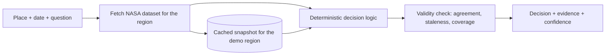

# Architecture: Gate 2 is closed

**Status: not approved, by design.** Gate 2 needs the team's approval of a concrete angle, and the event
forbids working on challenges before 14 November; the challenge statements arrive on 28 October. This
file therefore records only the constraints any demo-path architecture must meet. The actual design is
made at the start of the hackathon, after the team approves the angle.

## Demo path (shape only)

## Constraints decided now

1. **Only the demo path gets built.** One region, one person, one decision. Everything else is a slide.
2. **No language model in the live decision path.** If an LLM is used, it only phrases the explanation, a
   deterministic answer exists without it, and it is disclosed.
3. **A cached snapshot** for the demo region ships with the build; the live fetch is attempted first.
4. **The team's known stack**, chosen in the first 30 minutes of the hackathon — no stack debates.
5. **Evidence travels with the answer:** dataset name, date and link are part of the output, not a footnote.
6. **Validity check is a component, not a slide:** it must run on the demo query.

## Spikes for the first two hours of the hackathon

| Spike | Question | Kill criterion |
|---|---|---|
| Data access | Can we get the chosen dataset for the demo region in the event network? | No data in 60 minutes → switch dataset |
| Latency | Does the query return in under 5 seconds? | No → precompute for the region |
| Validity signal | Is there a real way to show when the data is unreliable (cloud cover, gaps, disagreement between sources)? | No → reconsider the merged angle |
